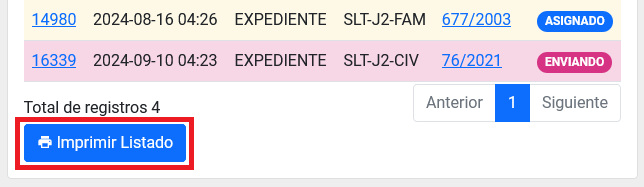
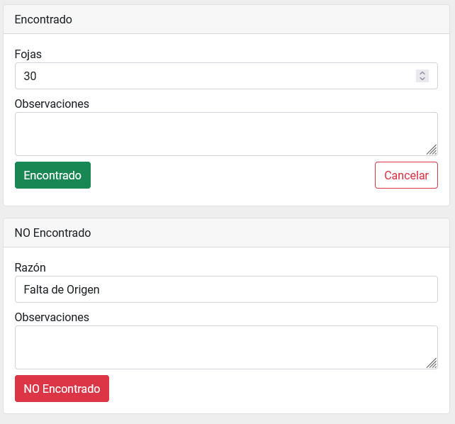

name: Buscar, imprimir listado y responder solicitudes de expedientes por parte del rol Archivista
Slug: plataforma_web_arc_archivista_solicitudes
Date: 2024-10-25 12:00
Modified: 2024-10-25 12:00
URL: plataformas/plataforma-web/arc/archivista-archivo-solicitudes/
Save_as: plataformas/plataforma-web/arc/archivista-archivo-solicitudes/index.html

Buscar, imprimir listado y responder solicitudes de expedientes por parte del rol _Archivista_.

## Índice

  - [Búsqueda de solicitudes](#búsqueda-de-solicitudes)
  - [Ingresar al detalle de una solicitud](#ingresar-al-detalle-de-una-solicitud)
  - [Imprimir Listado](#imprimir-listado)
  - [Responder Solicitud](#responder-solicitud)
  - [Consultar el Historial](#consultar-el-historial)

* * *

## Búsqueda de solicitudes

Ingrese al __módulo de Archivo__, dentro del menú general del lado izquierdo con el nombre Archivo. El primer listado será el de _Solicitudes_.

Puede utilizar los campos como filtros para reducir el número de registros en el listado y así encontrar un registro con más facilidad.

## Ingresar al detalle de una solicitud

Ingrese al __módulo de Archivo__, dentro del menú general del lado izquierdo con el nombre Archivo. El primer listado será el de _Solicitudes_.

Puede hacer una búsqueda para encontrar el registro indicado. [Búsqueda de solicitudes](#búsqueda-de-solicitudes).

De clic sobre el campo: _ID_ para ir al detalle de una solicitud.

.

Dentro del detalle podrá realizar más acciones, consultar la información de la solicitud y las bitácoras.

## Imprimir Listado

Al final del listado de _Solicitudes_ se encuentra el __botón de Imprimir Listado__. Presionelo para ir a otra página donde podrá mandar a imprimir el listado.

## Responder Solicitud

Entre al detalle de una solicitud con estado de _Asigando_.

Encontrará dos apartados:
  - Encontrado
  - NO Encontrado

Responda lo que acontece, llenado los campos requeridos y presionando sobre el __botón Encontrado__ o __botón NO Encontrado__, dependiendo del resultado a dar.

En el _listado de solicitudes_ el estado deberá cambiar al elegido.

## Consultar el Historial

Ingrese al __módulo de Archivo__, dentro del menú general del lado izquierdo con el nombre Archivo. El primer listado será el de _Solicitudes_.

En la parte superior del lado derecho aparecerá el __botón Historial__. Presione el botón y accederá al historial.

