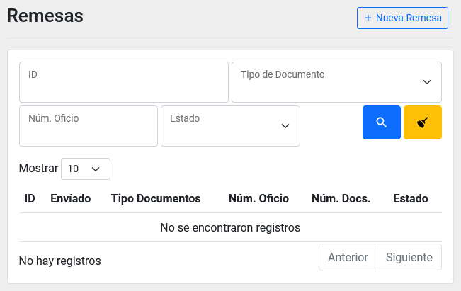
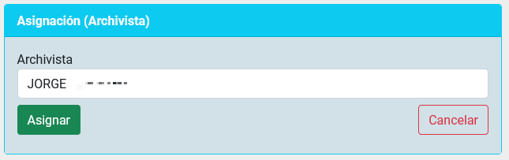

Title: Recepción y Asiganación de remesas por parte del rol Jefe de Remesas
Slug: plataforma_web_arc_jefe_remesa_remesas
Date: 2024-10-25 12:00
Modified: 2024-10-25 12:00
URL: plataformas/plataforma-web/arc/jefe-remesa-archivo-remesas/
Save_as: plataformas/plataforma-web/arc/jefe-remesa-archivo-remesas/index.html

Recepción y Asiganación de remesas por parte del _rol Jefe de Remesas_.

## Índice

  - [Búsqueda de remesa](#búsqueda-de-remesa)
  - [Ingresar al detalle de una remesa](#ingresar-al-detalle-de-una-remesa)
  - [Rechazar una remesa](#rechazar-una-remesa)
  - [Asignar un archivista](#asignar-un-archivista)

* * *

## Búsqueda de remesa

1. Ingrese al __módulo de Archivo__ y el segundo listado será el de _Remesas_.
2. Puede utilizar los campos como filtros para reducir el número de registros en el listado y así encontrar un registro con más facilidad.

## Ingresar al detalle de una remesa

1. Busque y identifique la remesa que desea consultar.
2. De clic sobre el campo de _ID_ para ir al detalle de una _remesa_.

3. Lo llevará a una nueva pantalla con los detalles de la remesa y sus bitácoras.

## Rechazar una remesa

1. Entre al detalle de una remesa que se encuentre en el estado de _Enviado_. [Ingresar al detalle de una remesa](#ingresar-al-detalle-de-una-remesa)
2. Vaya al apartado de _Rechazar_ y presione el __botón de Rechazar__.

3. En el listado de remesas ahora aparecera el registro con el estado _Rechazado_.

## Asignar un archivista

1. Entre al detalle de una remesa que se encuentre en el estado de _Enviado_.
2. Vaya al apartado de Asignación y seleccione un Archivista, después presione el __botón de Asignar__.

3. En el listado de remesas ahora aparecera el registro con el estado _Asignado_.
