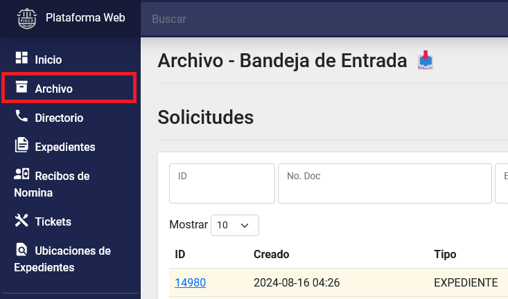
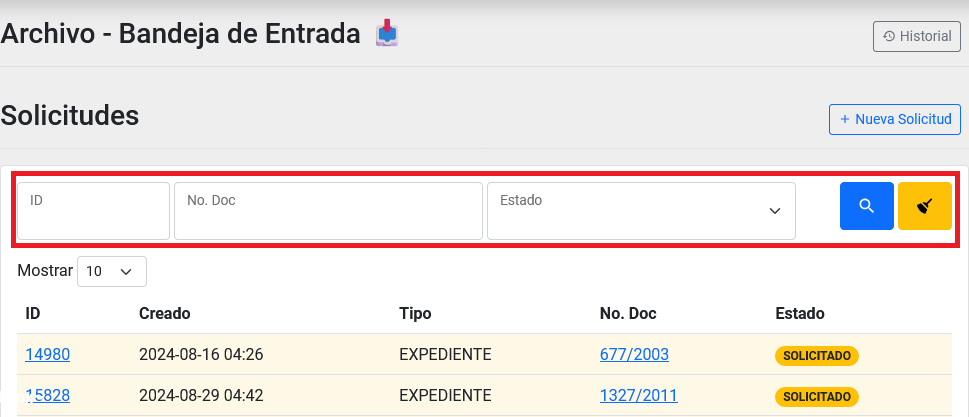
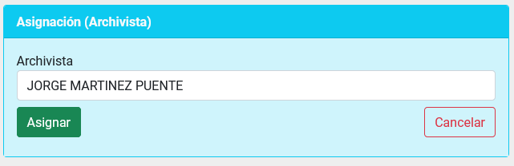
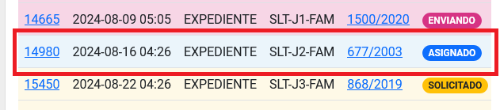
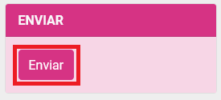

Title: Buscar, asignar y enviar solicitudes de expedientes por parte del rol Jefe de Remesa
Slug: plataforma_web_arc_jefe_remesa_solicitudes
Date: 2024-10-25 12:00
Modified: 2024-10-25 12:00
URL: plataformas/plataforma-web/arc/jefe-remesa-archivo-solicitudes/
Save_as: plataformas/plataforma-web/arc/jefe-remesa-archivo-solicitudes/index.html

Buscar, asignar y enviar solicitudes de expedientes por parte del rol _Jefe de Remesa_.

## Índice

  - [Búsqueda de solicitudes](#búsqueda-de-solicitudes)
  - [Ingresar al detalle de una solicitud](#ingresar-al-detalle-de-una-solicitud)
  - [Asignar un Archivista](#asignar-un-archivista)
  - [Enviar una Solicitud](#enviar-una-solicitud)
  - [Consultar el Historial](#consultar-el-historial)

* * *

## Búsqueda de solicitudes

1. Ingrese al __módulo de Archivo__, dentro del menú general del lado izquierdo con el nombre Archivo. El primer listado será el de _Solicitudes_.

2. Puede utilizar los campos como filtros para reducir el número de registros en el listado y así encontrar un registro con más facilidad.

3. De clic sobre el campo de _ID_ para ir al detalle de una solicitud.

## Ingresar al detalle de una solicitud

1. Ingrese al __módulo de Archivo__, dentro del menú general del lado izquierdo con el nombre Archivo. El primer listado será el de _Solicitudes_.

2. Puede hacer una búsqueda para econtrar el registro indicado. [Búsqueda de solicitudes](#búsqueda-de-solicitudes).
3. De clic sobre el campo: _ID_ para ir al detalle de una solicitud.
.
4. Dentro del detalle podrá realizar más acciones, consultar la información de la solicitud y las bitácoras.

## Asignar un Archivista

1. Entre al detalle de una _solicitud_. [Ingresar al detalle de una solicitud](#ingresar-al-detalle-de-una-solicitud)
2. Vaya al apartado de Asignación y del listado seleccione al _Archivista_ preferido y presione sobre el __botón de Asignar__.

3. En el listado de _solicitudes_ vera como cambia su estado a _Asigando_.

## Enviar una Solicitud

1. Una vez procesada por el _Archivista_ y si fue encontrada. En el detalle de la _solicitud_ [Ingresar al detalle de una solicitud](#ingresar-al-detalle-de-una-solicitud) aparecera el apartado de _Enviar_ con el __botón de Enviar__, presionelo cuando se encuentre listo para enviar dicha solicitud.

2. En el listado de _solicitudes_ vera como cambia su estado a _Enviado_.

## Consultar el Historial

1. Ingrese al __módulo de Archivo__, dentro del menú general del lado izquierdo con el nombre Archivo. El primer listado será el de _Solicitudes_.

2. En la parte superior del lado derecho aparecera el __botón Historial__. Presione el botón y accederá al historial.

