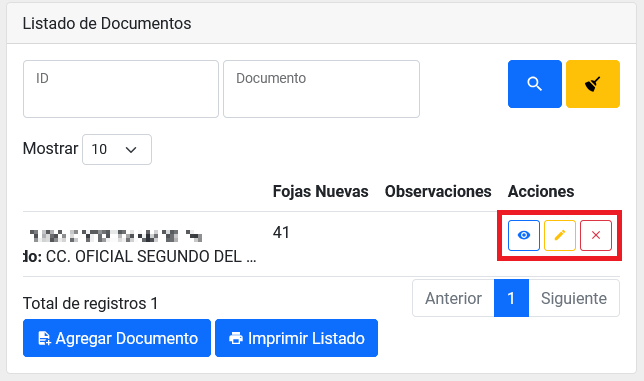

Title: Creación y envío de remesas por parte del rol solicitante
Slug: plataforma_web_arc_solicitante_remesas
Date: 2024-10-25 12:00
Modified: 2024-10-25 12:00
URL: plataformas/plataforma-web/arc/solicitante-archivo-remesa/
Save_as: plataformas/plataforma-web/arc/solicitante-archivo-remesa/index.html

Creación y envío de remesas por parte del _rol solicitante_.

## Índice

  - [Búsqueda de remesa](#búsqueda-de-remesa)
  - [Ingresar al detalle de una remesa](#ingresar-al-detalle-de-una-remesa)
  - [Nueva remesa](#nueva-remesa)
  - [Cancelar remesa](#cancelar-remesa)
  - [Añadir documentos a una remesa](#añadir-documentos-a-una-remesa)
  - [Pasar al Historial una solicitud](#pasar-al-historial-una-solicitud)
  - [Consultar el Historial](#consultar-el-historial)
  - [Imprimir listado de documentos anexos](#imprimir-listado-de-documentos-anexos)
  - [Pasar al historial una remesa](#pasar-al-historial-una-remesa)
  - [Consultar del historial](#consultar-el-historial)

* * *

## Búsqueda de remesa

1. Ingrese al __módulo de Archivo__ dentro del menú general del lado izquierdo con el nombre Archivo. El segundo listado será el de _Remesas_.

2. Puede utilizar los campos como filtros para reducir el número de registros en el listado y así encontrar un registro con más facilidad.

## Ingresar al detalle de una remesa

1. Ingrese al __módulo de Archivo__, dentro del menú general del lado izquierdo con el nombre Archivo. El segundo listado será el de _Remesas_.

2. Puede hacer una búsqueda para econtrar el registro indicado. [Búsqueda de solicitudes](#búsqueda-de-solicitudes).
3. De clic sobre el campo: _ID_ para ir al detalle de una solicitud.
.
4. Dentro del detalle podrá realizar más acciones, consultar la información de la solicitud y las bitácoras.

## Nueva remesa

1. Ingrese al __módulo de Archivo__ dentro del menú general del lado izquierdo con el nombre Archivo. El segundo listado será el de _Remesas_.

2. Localice al inicio de listado el __botón de Nueva Remesa__.

3. Al presionar sobre el botón ira a una nueva pantalla.

4. Rellene los campos y presione sobre el __botón de Crear__.
5. En el _listado de Remesas_ aparecera un nuevo registro con el estado de _Pendiente_.

## Cancelar remesa

1. Entre en el detalle de la remesa en cuestion que se encuentre en estado de _Pendiente_. [Ingresar al detalle de una remesa](#ingresar-al-detalle-de-una-remesa)
2. Presione el __botón de Cancelar__.

3. Acepte el mensaje de advertencia.

## Añadir documentos a una remesa

1. Entre al __módulo de Expedientes__.
2. Localice el documento que debe estar en ubicación _Juzgado_.
3. Presione el __botón Añadir a Remesa__.
4. En la nueva ventana seleccione la remesa indicada.

5. Rellene los campos restantes y presione sobre el __botón Agregar Documento__.

## Consultar, Editar o Quitar Documentos anexos a una remesa pendiente

1. Entre al detalle de una remesa que se encuentra en estado de _Pendiente_ y con un listado de documentos anexados. [Ingresar al detalle de una remesa](#ingresar-al-detalle-de-una-remesa)
2. Presione sobre los botones de acción que se encuentran en el listado de documentos en la columna derecha del registro.

## Imprimir listado de documentos anexos

1. Entre al detalle de una remesa que se encuentra en estado de _Pendiente_ y con un listado de documentos anexados. [Ingresar al detalle de una remesa](#ingresar-al-detalle-de-una-remesa)
2. Al final de _listado de documentos_ presione el __botón de Imprimir Listado__.

3. Abrirá una nueva pantalla donde verá el listado de documentos anexos a la remesa.

4. Presine el __botón de imprimir__ situado en la parte superior derecha de su pantalla.

## Enviar remesa

1. Entre al detalle de una remesa que se encuentra en estado de _Pendiente_ y con un listado de documentos anexados. [Ingresar al detalle de una remesa](#ingresar-al-detalle-de-una-remesa)
2. Se habilitará el __botón de Enviar__. Presione dicho botón cuando se encuentre listo para enviar a Archivo esta remesa.

3. Acepte el mensaje de alerta.
4. En el listado de remesas ahora aparecerá con el estado de _Enviando_ y el departamento de archivo envíara a alguien a recogerla.

## Pasar al Historial una remesa

1. Ingrese al detalle de una _remesa_ con estado de _Archivado_. [Ingresar al detalle de una remesa](#ingresar-al-detalle-de-una-remesa)
2. Ahora vera habilitado el __botón de Pasar al Historial__. De clic en él.

3. Esto hará que desaparezca de su listado de remesas, y pasará al listado de historial.

## Consultar el Historial

1. Ingrese al __módulo de Archivo__, dentro del menú general del lado izquierdo con el nombre Archivo.

2. En la parte superior del lado derecho aparecera el __botón Historial__. Presione el botón y accederá al historial.

