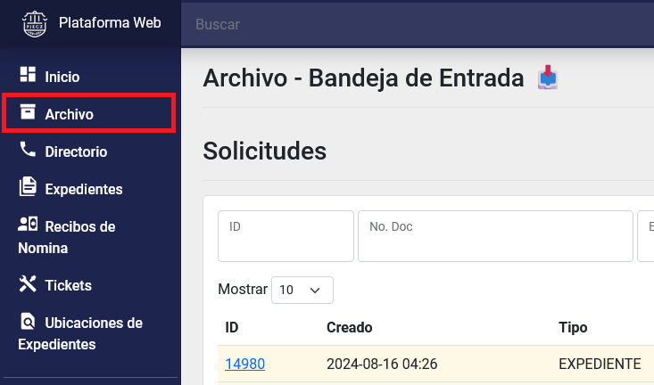

Title: Búsqueda, solicitar, cancelar, recibir y pasar al historial solicitudes de expedientes por parte del rol solicitante
Slug: plataforma_web_arc_solicitante_solicitudes
Date: 2024-10-25 12:00
Modified: 2024-10-25 12:00
URL: plataformas/plataforma-web/arc/solicitante-archivo-solicitudes/
Save_as: plataformas/plataforma-web/arc/solicitante-archivo-solicitudes/index.html

Búsqueda, solicitar, cancelar, recibir y pasar al historial solicitudes de expedientes por parte del _rol solicitante_.

## Índice

  - [Búsqueda de solicitudes](#búsqueda-de-solicitudes)
  - [Ingresar al detalle de una solicitud](#ingresar-al-detalle-de-una-solicitud)
  - [Nueva solicitud](#nueva-solicitud)
  - [Cancelar una solicitud](#cancelar-una-solicitud)
  - [Recibir una solicitud](#recibir-una-solicitud)
  - [Pasar al Historial una solicitud](#pasar-al-historial-una-solicitud)
  - [Consultar el Historial](#consultar-el-historial)

* * *

## Búsqueda de solicitudes

1. Ingrese al __módulo de Archivo__, dentro del menú general del lado izquierdo con el nombre Archivo. El primer listado será el de _Solicitudes_.

2. Puede utilizar los campos como filtros para reducir el número de registros en el listado y así encontrar un registro con más facilidad.

## Ingresar al detalle de una solicitud

1. Ingrese al __módulo de Archivo__, dentro del menú general del lado izquierdo con el nombre Archivo. El primer listado será el de _Solicitudes_.

2. Puede hacer una búsqueda para econtrar el registro indicado. [Búsqueda de solicitudes](#búsqueda-de-solicitudes).
3. De clic sobre el campo: _ID_ para ir al detalle de una solicitud.
.
4. Dentro del detalle podrá realizar más acciones, consultar la información de la solicitud y las bitácoras.

## Nueva solicitud

1. Ingrese al __módulo de Archivo__, dentro del menú general del lado izquierdo con el nombre Archivo. El primer listado será el de _Solicitudes_.

2. Presione sobre el __botón de Nueva Solicitud__ que se encuentra sobre el listado de _solicitudes_ o ingrese directamente al __módulo de Expedientes__ y filtrando por el campo de _ubicación_ seleccione el valor de _archivo_. Al entrar al detalle de un expediente vera activo un botón llamado __Solicitar__.

3. Presionando sobre el __botón Solicitar__, se iniciará una solicitud de expediente. Puede indicar un _Número de Folio_ o una _Observación_ y presione sobre el botón __Solicitar__.

## Cancelar una solicitud

1. Ingrese al detalle de una _solicitud_. [Ingresar al detalle de una solicitud](#ingresar-al-detalle-de-una-solicitud)
2. Si la _solicitud_ se encentra en estado de _SOLICITADO_ aparecera el __botón de Cancelar__. Presione el __botón de Cancelar__.

3. Acepte la ventana de advertencia.
4. Su solicitud ha sido cancelada.

## Recibir una solicitud

1. Ingrese al detalle de una _solicitud_ con estado de _Enviado_. [Ingresar al detalle de una solicitud](#ingresar-al-detalle-de-una-solicitud)
2. Dentro del detalle aparecerá el apartado de _Recibir_ con el __botón de Recibir__.

3. Presione el __botón de Recibir__ para cambiar el estado de la _solicitud_ a _Entregado_.

## Pasar al Historial una solicitud

1. Ingrese al detalle de una _solicitud_ con estado de _Entregado_. [Ingresar al detalle de una solicitud](#ingresar-al-detalle-de-una-solicitud)
2. Ahora vera habilitado el __botón de Pasar al Historial__. De clic en él.

3. Esto hará que desaparezca de su listado de solicitudes, y pasará al listado de historial.

## Consultar el Historial

1. Ingrese al __módulo de Archivo__, dentro del menú general del lado izquierdo con el nombre Archivo. El primer listado será el de _Solicitudes_.

2. En la parte superior del lado derecho aparecera el __botón Historial__. Presione el botón y accederá al historial.

