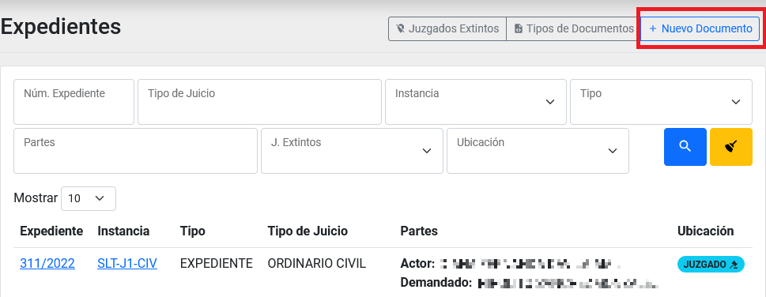
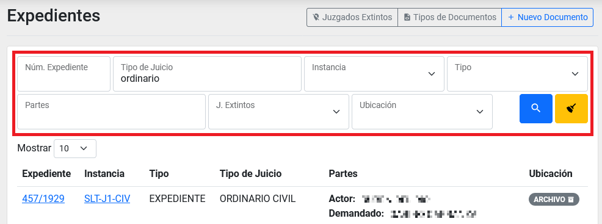
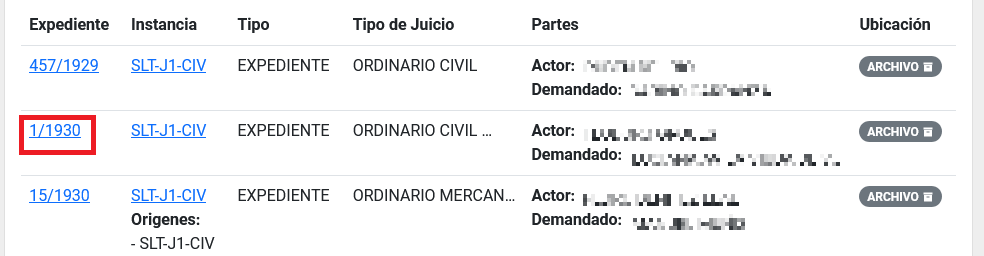

Title: Captura, búsqueda y edición de Expedientes pertenecientes al Archivo por parte de un usuario con cualquier rol
Slug: plataforma_web_arc_todos_expedientes
Date: 2024-10-25 12:00
Modified: 2024-10-25 12:00
URL: plataformas/plataforma-web/arc/todos-expedientes/
Save_as: plataformas/plataforma-web/arc/todos-expedientes/index.html

Captura, búsqueda y edición de Expedientes pertenecientes al Archivo por parte de un usuario con cualquier _rol_.

## Índice

  - [Captura de nuevo documento](#captura-de-nuevo-documento)
  - [Búsqueda de expediente](#búsqueda-de-expediente)
  - [Ingresar al detalle de un Expediente](#ingresar-al-detalle-de-un-expediente)
  - [Editar un expediente](#editar-un-expediente)

* * *

## Captura de nuevo documento

1. Ingresar al __módulo de Expedientes__ dando clic en la opción que se encuentra dentro del menú izquierdo general.

2. Presionar sobre el botón de __Nuevo Documento__ para comenzar la captura. Esto lo llevará a una nueva pantalla de captura.

3. Puede utilizar el recuadro del apartado: _búsqueda en Expediente Virtual_ para búscar por número de expediente y así recibir algunos campos ya rellenados.

4. Escriba los campos correspondientes y presione sobre el __botón Crear__ para guardar el documento.

## Búsqueda de expediente

1. Ingresar al __módulo de Expedientes__ dando clic en la opción que se encuentra dentro del menú izquierdo general.

2. Utilice los campos de filtrado de columnas para buscar por diferentes campos el registro que desea.

3. Presione sobre el campo: _Número de Expediente_ del registro. Ingresará al detalle del expediente.

4. Aquí puede editar, eliminar y revisar las bitacoras del expediente, sus solicitudes y remesas en las que ha paticipado.

## Ingresar al detalle de un Expediente

1. Ingresar al __módulo de Expedientes__ dando clic en la opción que se encuentra dentro del menú izquierdo general.

2. Presione sobre el campo: _Número de Expediente_ del registro. Ingresará al detalle del expediente.

3. Aquí puede editar y revisar la información del Expediente y sus bitacoras, sus solicitudes y remesas en las que ha paticipado.

## Editar un expediente

1. Ingresar al __módulo de Expedientes__ dando clic en la opción que se encuentra dentro del menú izquierdo general.

2. Localice el expediente que desea haciendo uso de los filtros o consulte el apartado de [búsqueda de expediente](#búsqueda-de-expediente).
3. Presione sobre el campo: _Número de Expediente_ para ingresara al detalle del expediente.
4. Presione sobre el __botón de Editar__.

5. Cambie los campos que desea y presione sobre el __botón Guardar__.
